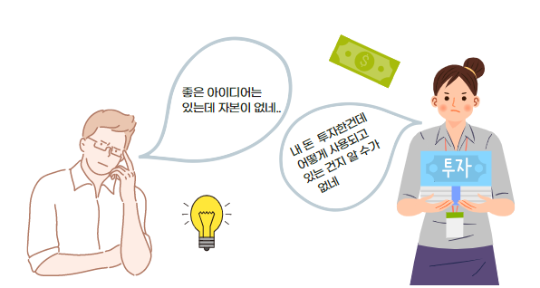
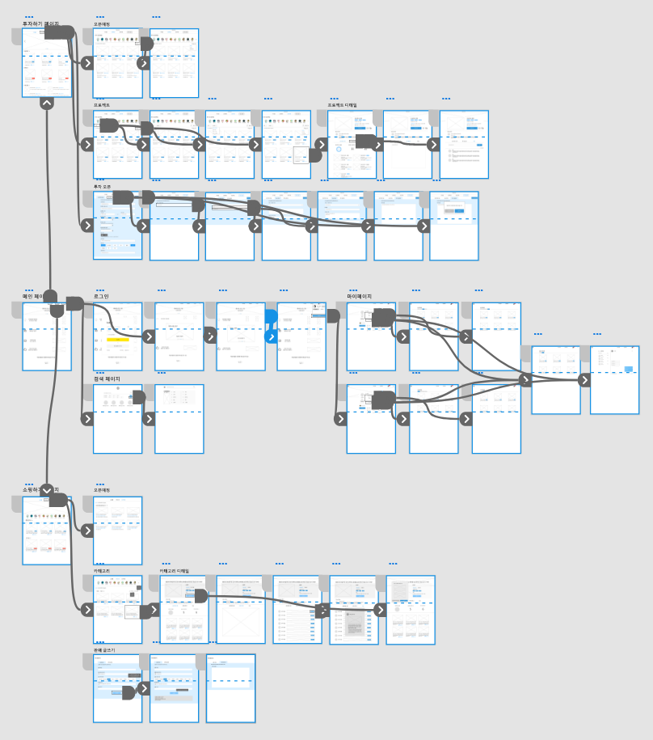
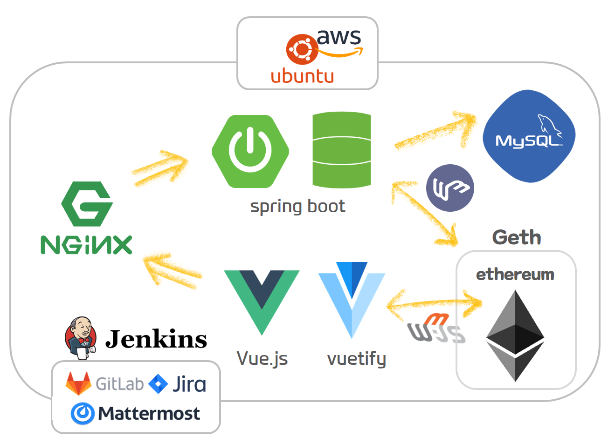

# TwoJob (투자를 잡아라) 


### 목차

- [서비스 개요](#서비스-개요)

- [제작 배경](#제작-배경)

- [주요 기능](#주요-기능)

- [서비스 이용방법](#서비스-이용방법)

- [서비스 차별점](#서비스-차별점)

- [블록체인 적용방안](#블록체인-적용방안)

- [와이어프레임](#와이어프레임)

- [기술 스택](#기술-스택)

- [commit message rule](#commit-message-rule)

  

##  📘서비스 개요

사업자의 이전 투자프로젝트 정보<sup>[1](#footnote_1)</sup> 공개를 통한 신뢰 가능한 투자/쇼핑 플랫폼


## ✨제작 배경




큰 맘 먹고 어렵게 모은 돈을 투자했는데, 투자금이 어떻게 사용되는 건지 알 수 없어서 답답하지는 않으셨나요? 
좋은 아이디어는 있는데 자본이 없어 상품을 출시하지 못하진 않으셨나요?
투잡에서는 **블록체인** 기술을 적용해 **위변조 불가능한 거래 내역을 공개**하고, **소자본**으로 누구나 **상품을 출시할 기회**를 제공하고 있습니다.


## :bulb: 주요 기능

- #### 블록체인

    - 프로젝트 이력, 투자금 운용 내역 저장

    - 투자 프로젝트 목표금액을 달성시 중간계좌에 모인 돈 사업자가 수령가능

    - 상품 판매 수익금 투자 비율에 따라 투자자들에게 분배

- #### 투자

    - 사업자: 사업 아이템을 투자 프로젝트로 오픈

    - 투자자: 사업자의 과거 투자 프로젝트 이력 및 투자금 운용내역 열람, 투자 가능 

    - 투자 프로젝트 오픈 게시글을 올리면, 해당 게시글의 해시값은 DB에서 관리되어 이후 거래명세를 확인하는데 사용

    - 투자 프로젝트 목표금액을 달성하게 되면, 중간계좌에 모인 돈이 사업자에게 옮겨짐<sup>[2](#footnote_2)</sup>

- #### 쇼핑

    - 사업자: 투자 프로젝트 목표금액 100% 달성시 상품 판매 가능  

    - 소비자: 원하는 상품 구매  

    - 목표금액을 달성한 투자 게시글은 이후 판매(쇼핑 프로젝트 오픈)를 할 수 있으며, 이윤의 X%를 투자자들에게  분배함


##  :blush: 서비스 이용방법

- #### 사업자

  - 투자받고자 하는 아이디어/상품을 양식에 맞게 작성하여 투자 프로젝트 오픈

  - 투자 목표 금액 달성시 중간계좌에서 주는 투자금으로 상품 제작, 미달성시 프로젝트 종료

  - 상품 제작 완료 후, 상품 판매(쇼핑 프로젝트 오픈) 가능  

- #### 투자자

  - 해당 프로젝트 설명서와 과거 프로젝트 이력 및 투자금 운용내역을 열람하고 투자하고자 하는 프로젝트에 투자 가능

  - 사업자에게 1:1 문의 가능

  - 프로젝트 목표금액이 달성된 경우, 상품 출시후 수익의 X%를 투자금에 따라 회수

  - 프로젝트 목표금액이 달성되지 못한 경우, 원금 회수 가능

- #### 소비자

  - 카테고리별 원하는 상품 선택 후, 구매 가능

  - 사업자에게 1:1 문의 가능


## :eyes: 서비스 차별점

- #### 소비자

	- 블록체인을 통해 투자자들에게 위변조 불가능한 투명한 정보 제공

- #### 사업자

  - 아이디어만 있다면 소자본으로 이익 창출 가능

  - 본인의 아이디어에 대한 상품화 가능성 확인 가능


## :ballot_box: 블록체인 적용방안

- 블록체인은 투자금액을 모금하는 중간계좌 뿐 아니라 수익을 분배할 때 사용

- 또한, 유저의 투자 게시글 정보와 판매 명세를 블록으로 저장하여 이후 투자자들이 투자할 때 참고할 수 있는 정보로 제공


## 🎫 와이어프레임

:link: https://xd.adobe.com/view/adaaaf5b-9132-4b7c-96aa-b082be9f2062-f8f9/




## 🔧기술 스택




## :pencil: ​commit message rule

```
[FE/BE/BC/etc] 동사 + 페이지 이름 + 추가하고 싶은 메시지 

#지라번호
```

- 동사: Add, Update, Fix(버그 수정), Delete

- 예시

  ```
  [FE] Fix adminpage design
  
  #S02P13B205-332 
  ```


## :family: Author

#### 이준형, 권남선, 김지은, 박현영, 정성오


---

<a name="footnote_1">1</a>) 과거 투자 프로젝트 이력 및 투자금 운용내역

<a name="footnote_2">2</a>) 목표금액 미달성시, 투자자들에게 투자한만큼 돌아감


 